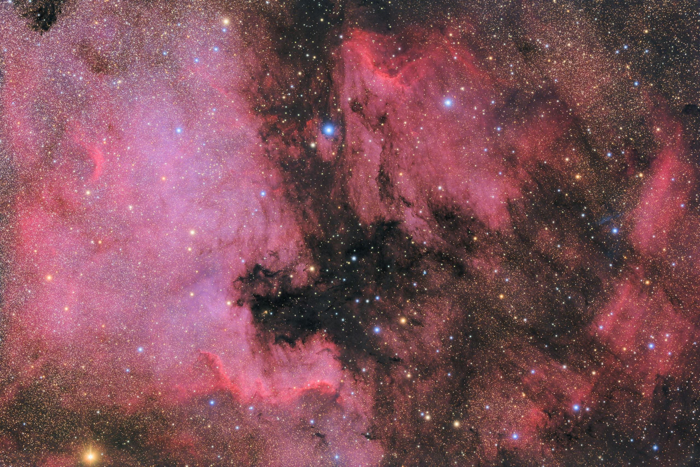

# Paris-Saclay OHP Summer School 2023

Our objective will be to build collectively images of the [NGC 7000](https://en.wikipedia.org/wiki/North_America_Nebula) / [IC 5070 / IC 5067](https://en.wikipedia.org/wiki/Pelican_Nebule) complex, *a.k.a.* the North America and Pelican nebulae. We will acquire and reduce the date necessary to produce an image in 'natural' RGB colors and in 'false color' narrow band (SII, H&#0945;, OII). 

Beyond making pretty pictures, our objective will be to understand the data acquisition chain and the calibration process. This will be performed using a [refracting telescope](https://en.wikipedia.org/wiki/Refracting_telescope), a camera and filters, all commercially available. . We will measure the physical properties of the [CMOS sensor](https://en.wikipedia.org/wiki/Active-pixel_sensor), understand the sources of noise in the data, and derive the optimum acquisition parameters. The principles and methods exposed are generic and applicable to amateur equipment and professional giant telescopes alike.

ESPRIT 100 ED / Canon EOS 6D / 10 hours
## Equipment

### Hardware

- Telescope: [Skywatcher ESPRIT 100 ED
](https://inter-static.skywatcher.com/upfiles/en_download_caty01390352363.pdf)
- Equatorial mount: [Skywatcher AZ-EQ6](https://inter-static.skywatcher.com/upfiles/en_download_caty01353096919.pdf)
- Camera: [ZWO ASI 2600 MM Cool](https://astronomy-imaging-camera.com/manuals/ASI2600_Manual_EN.pdf)
- Filter wheel: [ZWO EFW](https://astronomy-imaging-camera.com/manuals/EFW%20QuickGuide.pdf
- Filters: broad band [Luminance, Red, Green, Blue](https://www.baader-planetarium.com/en/filters/l-rgb-cmos-filters/baader-lrgb-filter-set-%E2%80%93-cmos-optimized.html) and narrow band (6 nm) [SII, H&#0945;, OIII](
https://www.baader-planetarium.com/en/filters/(ultra-)-narrowband-/-highspeed/baader-6.5nm-narrowband-filter-set-%E2%80%93-cmos-optimized-(h-alpha--o-iii--s-ii).html)

### Software

- Equatorial mount driver: [EQASCOM](https://eq-mod.sourceforge.net/eqaindex.html) 
- Sequencer: [Astro Photography Tool (APT)](https://astrophotography.app/)

## The acquisition chain

The signal S(**x**) measured in DN (Digital Number, *a.k.a.* ADU, Analog to Digital Unit) by the detector is equal to

S(**x**) = g(**x**) * [ t * ( Q(**x**, &#0955;) * I(**x**) + N(**x**, T) ) + R(**x**) ] + B(**x**)

where:
- **x** is the vector position on the detector.
- &#0955; is the wavelength.
- I(**x**) is the intensity incident on the detector, in photons per second.
- Q(**x**, &#0955;) is the [external quantum efficiency](https://en.wikipedia.org/wiki/Quantum_efficiency) (EQE), *i.e.* the number of photo-electrons created per incident photon.
- g(**x**) is the gain of the detector, *i.e.* the number of DN per photo-electron.
- N(**x**, T) is the thermal signal, function of the temperature T, in electrons per second.
- t is the exposure time, in seconds.
- R(**x**) is the read noise, in electrons.
- B(**x**) is the bias of the Analog to Digital Converter(s) (ADC), *i.e.* the output value that corresponds to zero incident intensity, in DN per electron. The bias is set to a positive value to avoid clipping of faint signals to zero.

It is important to note that for a given pixel, I(**x**), N(**x**, T) and R(**x**) are functions of time because of the statistical fluctuations of the photon and thermal signals, and because of the noise in the readout electronics. I, N and R must thus be understood as random variables.

The above equation can be rewritten:

S(**x**) = g(**x**) * [ t * Q(**x**) * I(**x**) + R(**x**) ] + g(**x**) * t * N(**x**, T) + B(**x**)

We do not have the capability here to measure the EQE, but anyway the relevant quantity to compute the [photon shot noise](https://en.wikipedia.org/wiki/Shot_noise) in the image is E(**x**) = EQE(x) * I(x), *i.e.* the number of electrons. We thus have 

S(**x**) = g(**x**) * [ t * E(**x**) + R(**x**) ] + g(**x**) * t * N(**x**, T) + B(**x**)

As mentioned above, E, N and R are random variables, and therefore so is the measured signal S. In an image, the value measured in a pixel can be understood as an estimate of the average of the random variable affected by random fluctuations (noise).

The objective of the calibration of the detector is to be able to determine I'(**x**) knowing the measure signal S(**x**). 

R(**x**) has zero mean and is . we subtract the mean of the random variables. 

- The last two terms ([bias](bias.ipynb) + thermal signal) can be measured by taking '[dark frames](darks.ipynb)', *i.e.* images taken without illuminating the detector.

- The gain g(**x**) and read noise R(**x**) can be measured simultaneously using a method called the [Photon Transfer Curve (PTC)](ptc.ipynb) analysis.

- The PTC analysis will typically provide the mean value of the gain over the detector. The pixel-to-pixel variations of the gain are called the '[flat-field](flats.ipynb)' and can be measured using a uniform light source. By extension, the term flat-field is used to describe the combination of all the multiplicative terms that affect the spatial variations of the response of the instrument (*e.g.* the [vignetting](https://en.wikipedia.org/wiki/Vignetting)).  

It is worth noting that thermal electrons cannot be distinguished from photo-electrons. They obey to the same [Poisson statistics](https://en.wikipedia.org/wiki/Poisson_distribution). 

## Exposure time *vs.* number of images

The standard deviation of the noise in a single frame is obtained by taking the quadratic sum of the standard deviation of the read noise &#0963;_r

&#0963;&#0178; = &#0963;_r&#0178; + t * (I + N)  

with t the exposure time and I and N respectively the photon and thermal signals, in electrons per second. When stacking (summing) n frames, the noises add quadratically and the noise in the resulting image is thus simply given by

&#0963;&#0178; = n * [ &#0963;_r&#0178; + t * (I + N) ]  

The photon signal is itself the sum of the signal A from the astronomical object of interest and of the sky background brightness K

&#0963;&#0178; = n * [ &#0963;_r&#0178; + t * (A + K + N) ]
